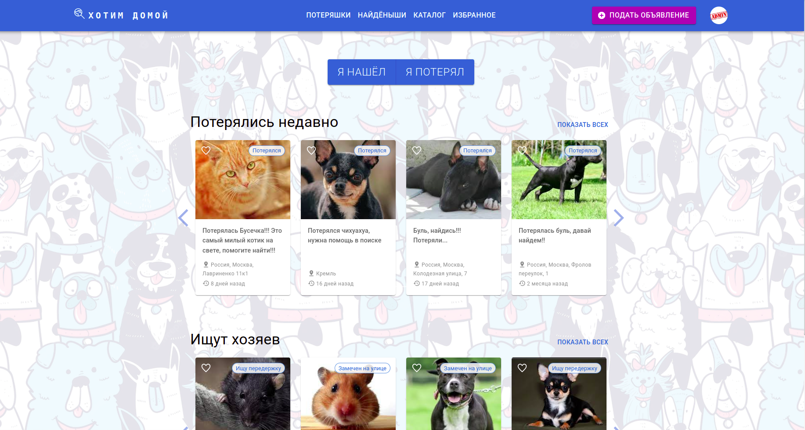
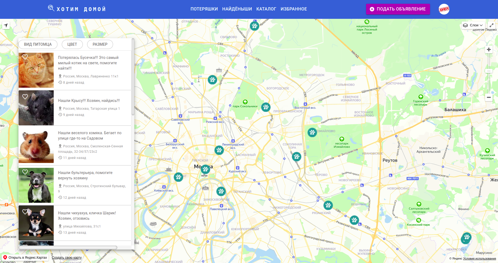
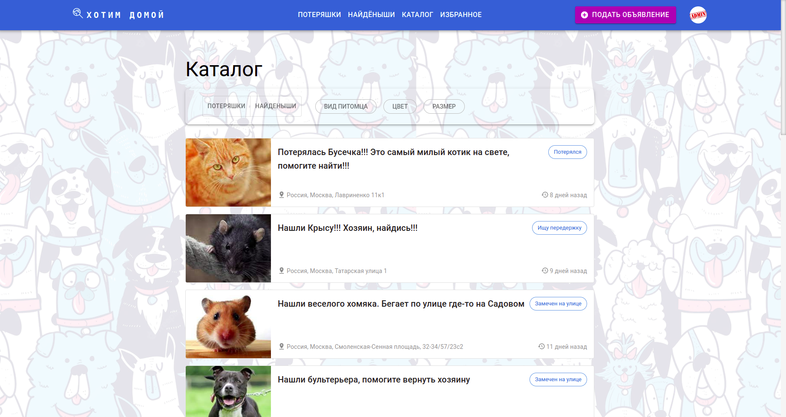
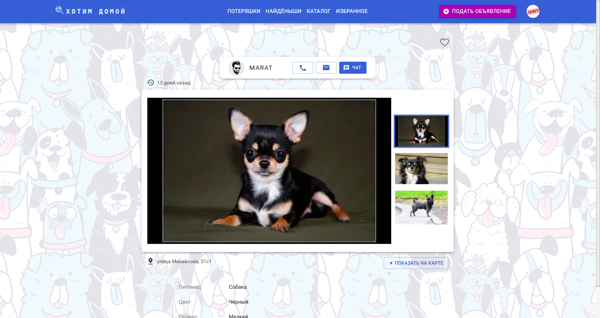
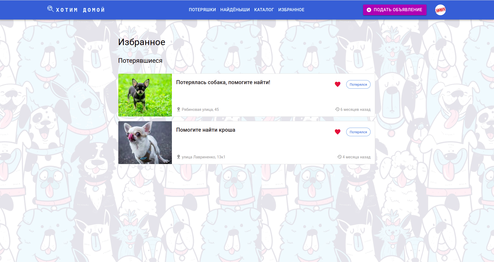
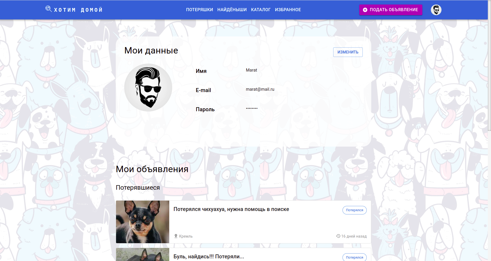

# Хотим домой (командный проект)
<h3>
We Want Home - is a service for posting ads about lost and found animals.
</h3>

<h4>
Here are some screenshots of the application:
</h4>

Main page. It all starts from here.

One of the main features of our project is the ability to display all user announcements on the map (lost animals - in the "Lost" tab, found ones - in the "Found" tab).

You can also view a list of all ads, apply the necessary filters to make your search easier.

By going to the card of a particular animal, you can see detailed information about it. In addition, you can contact the user who posted the ad via phone, email, and also send a message to the chat.

Конечно же, любое объявление можно добавить в избранное.

In your personal account, you can upload/change your personal photo, edit the data, and also view the list of ads you have posted.

